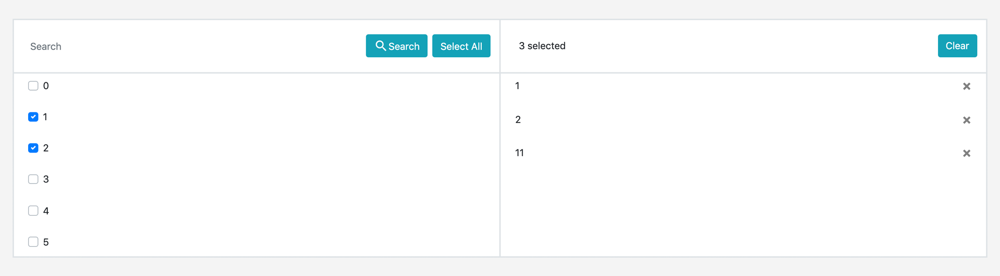

# react-checkbox-selectable

[](https://www.npmjs.com/package/react-checkbox-selectable) [](https://standardjs.com)

A checkbox selectable input table for large select options with support for drag and drop feature

<p align="center">
    
</p>

### Installation

Through npm:
```bash
npm install --save react-checkbox-selectable
```

Through yarn:
```bash
yarn add react-checkbox-selectable
```


### Usage

```jsx
import { CheckboxSelectable } from 'react-checkbox-selectable';

class Example extends Component {
  render () {
    return (
        <CheckboxSelectable
            items={items}
            selectedItems={selectedItems}
            onChange={selectedItems => {/* Do whatever you want with the selectedItems data*/}}
            customButton={CustomButton}
        />
    )
  }
}
```


### Properties

| Name                          | Type        | Default                 | Option   | Description                                                                                             |
| :---------------------------- | :---------- | :---------------------- | -------- | :------------------------------------------------------------------------------------------------------ |
| `items`                       | `Array`     | []                      | required | list of items.                                                                                          |
| `selectedItems`               | `Array`     | []                      | required | selected list to start with (subgroup of items).                                                        |
| `onChange`                    | `function`  | (selectedItems)=>{}     | required | callback for changed event.                                                                             |
| `customButton`                | `Component` | Button                  | optional | toggle to show loading indication.                                                                      |


### Notes

In current version, items given to the `items` and `selectedItems` props support only as the below format shown. This rule apply similarly as the `selectedItems` argument that passed through the `onChange` props. It is in future planning that the provision of `getOptionLabel` and `getOptionId` props to be added for better user experience.
    
```
 const items = [
    {id: 0, label: 'A'},
    {id: 1, label: 'B'},
    ...
 ]
```


In addition, drag and Drop feature is only supported on the selected items list. 


### Contributing
Feel free to make any pull request that will better enhance the component.


### License

MIT © [Wnyao](https://github.com/Wnyao)
